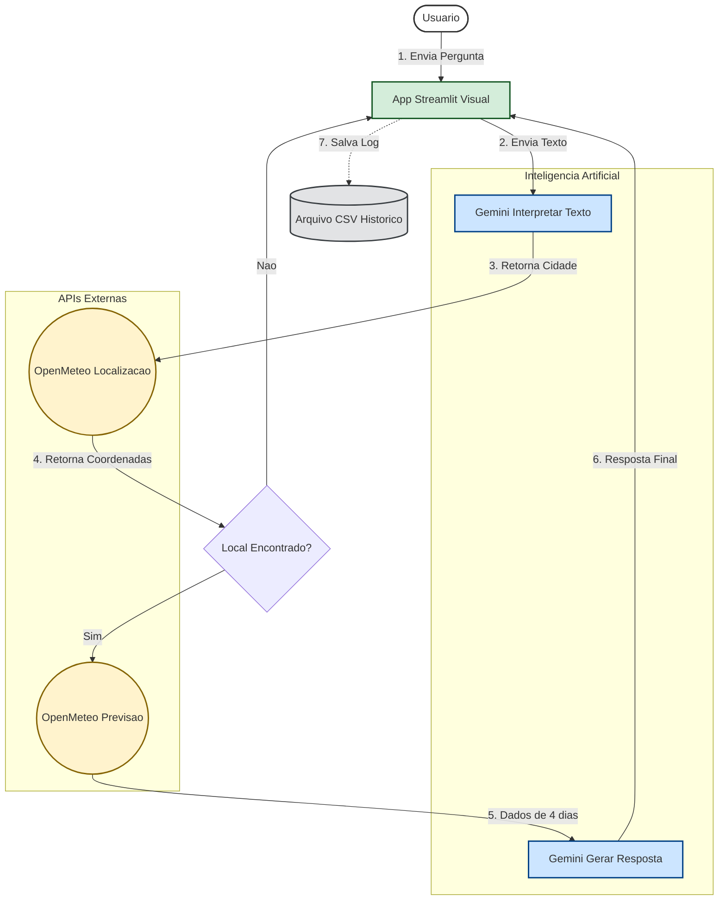

# Chatbot Meteorológico

> **Versão:** 1.0.0
> **Tecnologia:** Python, Streamlit, Google Gemini (LLM), Open-Meteo

## Sobre o Projeto
Este projeto é um assistente virtual conversacional focado em meteorologia. Diferente de aplicações de clima tradicionais, ele utiliza **Inteligência Artificial Generativa (LLM)** para interpretar perguntas em linguagem natural, extrair intenções e fornecer respostas contextualizadas, objetivas e com tom jornalístico.

O sistema é capaz de buscar dados históricos (passado) e previsões futuras (até 4 dias), mantendo o contexto da conversa e registrando logs para auditoria.

---

## Arquitetura do Sistema

O projeto segue um fluxo de dados linear combinando **NLP** (Processamento de Linguagem Natural) com dados determinísticos (APIs de clima).



---

## Funcionalidades Principais

* **Processamento de Linguagem Natural (NLP):** O usuário não precisa digitar apenas o nome da cidade. O bot entende frases como *"Choveu ontem no bairro da Lapa?"* e extrai o local correto.
* **Análise Temporal:** O sistema consulta dados de **2 dias atrás** até **7 dias à frente**, permitindo perguntas sobre o passado recente e o futuro.
* **Persistência de Logs:** Todas as interações (pergunta, resposta, local detectado e condições climáticas) são salvas automaticamente em um arquivo `historico_logs.csv`.
* **Portabilidade:** O código utiliza caminhos relativos, funcionando em qualquer máquina sem necessidade de configuração de pastas complexas.

---

## Stack Tecnológico

| Tecnologia | Função no Projeto |
| :--- | :--- |
| **Python 3.x** | Linguagem Core (Backend e Lógica). |
| **Streamlit** | Framework para construção da Interface Web (Frontend). |
| **Google Gemini 2.5 Flash** | LLM utilizado para interpretar intenções e gerar textos humanizados. |
| **Open-Meteo API** | Fonte de dados meteorológicos e geocodificação (Open Source). |
| **CSV / OS** | Manipulação de arquivos para sistema de logs locais. |

---

## Detalhamento Técnico das Funções

Para fins de manutenção e entendimento da lógica, abaixo descreve-se a responsabilidade de cada módulo:

### 1. `extrair_local_nlp(texto)`
Utiliza a IA para limpar a entrada do usuário. Remove ruídos da frase e isola as entidades geográficas (Cidade/Bairro).
> *Exemplo:* Entrada: "Quero saber se chove em Campinas agora" -> Saída: "Campinas".

### 2. `obter_coordenadas(nome_local)`
Converte o nome da cidade em coordenadas geográficas (Latitude e Longitude) consultando a API de Geocoding. Inclui lógica de *fallback* para garantir que o resultado mais relevante seja retornado.

### 3. `obter_previsao(lat, lon)`
Realiza a requisição dos dados brutos. Configurada para buscar janelas de tempo estendidas (`past_days=2` e `forecast_days=7`) e dados horários de precipitação para maior precisão.

### 4. `gerar_resposta_nlp(...)`
O "cérebro" da resposta. Recebe os dados numéricos e utiliza um **Prompt de Sistema** para transformar números em um texto jornalístico, objetivo e sem alucinações.

### 5. `registrar_log(...)`
Módulo de auditoria. Verifica a existência do diretório de logs e registra a transação. Utiliza caminhos relativos para garantir compatibilidade entre diferentes sistemas operacionais.

---

## Instalação e Execução

Siga os passos abaixo para rodar o projeto localmente:

1.  **Clone o repositório:**
    ```bash
    git clone https://github.com/jvcssz/projeto-chatbot.git
    ```

2.  **Instale as dependências:**
    ```bash
    pip install -r requisitos.txt
    ```

3.  **Configuração da API Key:**
    * Abra o arquivo `app.py`.
    * Localize a variável `API_KEY` e insira sua chave do Google AI Studio.

4.  **Execute a aplicação:**
    ```bash
    streamlit run app.py

    ```


